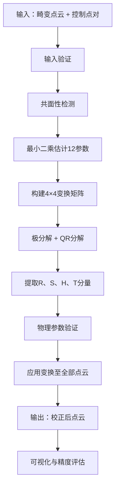

# 12参数仿射变换点云畸变消除MATLAB算法

## 概述

本算法实现了基于12参数仿射变换的点云畸变消除功能，用于解决LiDAR硬件系统中的残留系统偏差，包括：

- 3轴非正交于90°
- 内部刻度盘误差
- 扫描带重叠区的失配现象

---

## 文件结构

```
d:\Study\仿射变换\
├── affine12_main.m              # 主函数：完整畸变消除流程
├── affine12_estimate.m          # 最小二乘估计12参数
├── affine12_build_matrix.m      # 构建4×4仿射变换矩阵
├── affine12_decompose.m         # 矩阵分解（提取R、S、H、T）
├── affine12_apply.m             # 应用变换至点云
├── affine12_validate.m          # 物理参数校核
├── affine12_demo.m              # 演示脚本（微小畸变，模拟真实硬件误差）
├── affine12_demo_visible.m      # 演示脚本（明显畸变，便于可视化理解）
└── utils/
    ├── check_coplanarity.m      # 共面性检测
    ├── compute_rmse.m           # 计算RMSE误差
    └── visualize_pointcloud.m   # 点云可视化
```

---

## 快速开始

### 运行演示

```matlab
cd 'd:\Study\仿射变换'
addpath('utils')

% 推荐：可视化效果明显的演示
affine12_demo_visible

% 或者：模拟真实硬件误差的演示（畸变很小，肉眼难以区分）
affine12_demo
```

### 基本用法

```matlab
% 加载点云和控制点
distorted = load('distorted_cloud.txt');   % N×3 畸变点云
src_ctrl = load('src_control.txt');        % M×3 源控制点（畸变点云中）
dst_ctrl = load('dst_control.txt');        % M×3 目标控制点（真实位置）

% 执行畸变消除
[corrected, M, stats] = affine12_main(distorted, src_ctrl, dst_ctrl);

% 查看结果
fprintf('RMSE: %.4f\n', stats.rmse);
```

---

## 两个演示脚本的区别

| 脚本                      | 畸变参数                        | 用途                       |
| ------------------------- | ------------------------------- | -------------------------- |
| `affine12_demo.m`         | 微小（旋转<1°，缩放偏差<0.5%）  | 模拟真实LiDAR硬件误差      |
| `affine12_demo_visible.m` | 明显（旋转15-20°，缩放偏差15%） | 教学演示，便于理解算法效果 |

### affine12_demo_visible 可视化内容

运行后会生成多个图窗：

1. **畸变效果对比（3子图）**
   - 原始点云（真值）
   - 畸变点云（旋转+缩放+切变+平移）
   - 校正后点云

2. **点云叠加对比（2子图）**
   - 蓝色=原始 | 红色=畸变（完全分离）
   - 蓝色=原始 | 绿色=校正后（高度重合）

3. **建筑物对比（2×3子图）**
   - 第一行：分别显示原始、畸变、校正后建筑物
   - 第二行：
     - 蓝+红叠加：原始与畸变完全分离
     - 蓝+绿叠加：原始与校正后高度重合
     - 误差连线图：红线越短=校正越准确

4. **误差分析（2子图）**
   - 误差大小直方图
   - XYZ分量误差分布

---

## 核心函数

### 1. affine12_main - 主函数

```matlab
[corrected_pts, M, stats] = affine12_main(distorted_pts, src_ctrl, dst_ctrl, options)
```

| 参数                | 说明                     |
| ------------------- | ------------------------ |
| `distorted_pts`     | 待校正点云 (N×3)         |
| `src_ctrl`          | 源控制点 (M×3)，M≥4      |
| `dst_ctrl`          | 目标控制点 (M×3)         |
| `options.validate`  | 是否验证参数（默认true） |
| `options.visualize` | 是否可视化（默认true）   |

---

### 2. affine12_estimate - 参数估计

```matlab
[M, residuals, rmse] = affine12_estimate(src_pts, dst_pts)
```

使用最小二乘法估计12参数仿射变换矩阵。

---

### 3. affine12_build_matrix - 矩阵构建

```matlab
M = affine12_build_matrix(rotation_angles, scale_factors, shear_angles, translation)
```

根据物理参数构建4×4变换矩阵：

- `rotation_angles`: [ω, φ, κ] 旋转角（弧度）
- `scale_factors`: [λ₁, λ₂, λ₃] 缩放因子
- `shear_angles`: [θ₁, θ₂, θ₃] 切变角（弧度）
- `translation`: [tx, ty, tz] 平移

---

### 4. affine12_decompose - 矩阵分解

```matlab
[R, S, H, T, params] = affine12_decompose(M)
```

将4×4变换矩阵分解为旋转、缩放、切变和平移分量。

---

### 5. affine12_validate - 参数验证

```matlab
[is_valid, warnings, report] = affine12_validate(params, thresholds)
```

验证参数的物理合理性：

- 缩放偏差是否在±1%内（可配置）
- 切变角是否小于±1°（可配置）

---

## 数学原理

### 12参数仿射变换模型

$$
\mathbf{R}_A = [ R(\omega, \phi, \kappa) \cdot S(\lambda_1, \lambda_2, \lambda_3) \cdot H(\theta_1, \theta_2, \theta_3) ] \cdot \mathbf{r}_B + \mathbf{T}
$$

### 4×4齐次变换矩阵

$$
 M = \begin{bmatrix} A & T \\ 0 & 1 \end{bmatrix} 
$$

其中
$$
 A = R \cdot S \cdot H 
$$
为3×3仿射子矩阵。

### 参数分解

| 分量   | 参数       | 描述                        |
| ------ | ---------- | --------------------------- |
| 旋转 R | ω, φ, κ    | 绕X、Y、Z轴旋转（3参数）    |
| 缩放 S | λ₁, λ₂, λ₃ | 各向异性缩放（3参数）       |
| 切变 H | θ₁, θ₂, θ₃ | XY、XZ、YZ平面切变（3参数） |
| 平移 T | tx, ty, tz | 三轴平移（3参数）           |

---

## 算法流程



---

## 注意事项

1. **控制点要求**：至少需要4对非共面控制点
2. **参数阈值**：默认缩放偏差±1%，切变角±1°
3. **噪声影响**：高噪声数据建议增加控制点数量
4. **数值稳定性**：如控制点接近共面会发出警告

---

## 验证结果

### affine12_demo（微小畸变）

| 指标         | 值     |
| ------------ | ------ |
| 控制点RMSE   | < 0.02 |
| 全局恢复RMSE | < 0.02 |
| 参数验证     | 通过   |

### affine12_demo_visible（明显畸变）

| 指标                | 值     |
| ------------------- | ------ |
| 畸变前后差异 (RMSE) | ~10-15 |
| 校正后误差 (RMSE)   | < 0.1  |
| 误差减少倍数        | >100x  |

---

## 常见问题

### Q: 为什么运行 affine12_demo 看不出畸变效果？

**A**: 该脚本模拟真实LiDAR硬件误差，畸变参数非常微小（旋转<1°，缩放<0.5%），肉眼难以区分。请运行 `affine12_demo_visible` 查看明显的畸变效果。

### Q: 如何判断校正效果好不好？

**A**: 查看以下指标：

1. 控制点RMSE越小越好
2. 蓝+绿叠加图中两个点云重合程度越高越好
3. 误差连线图中红线越短越好
